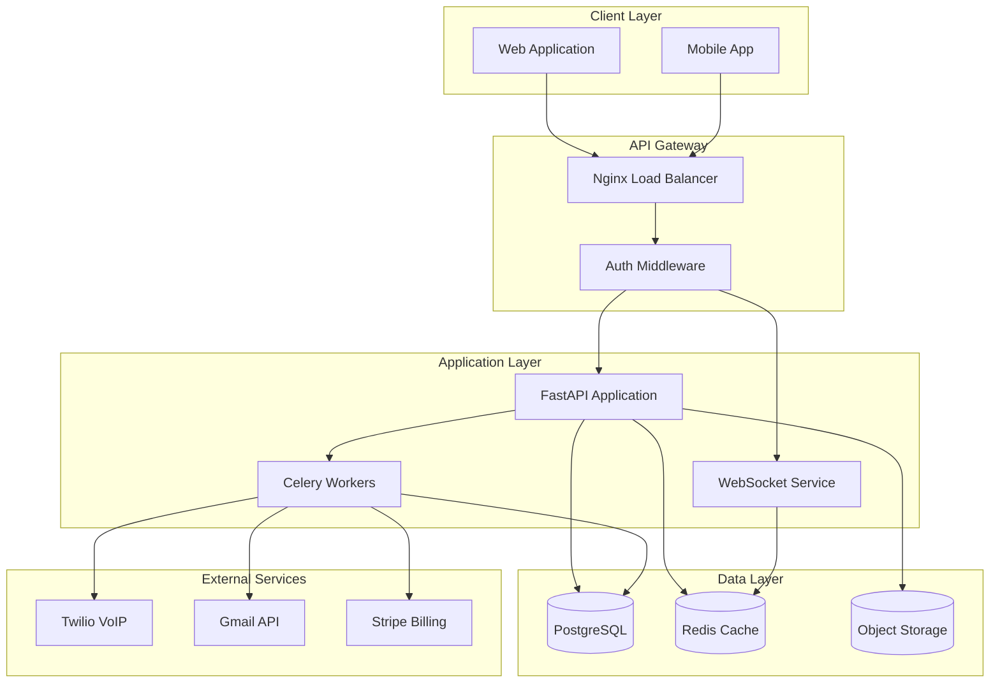

# Design Document

## Overview

The Sales Engagement Platform is designed as a multi-tenant, microservices-oriented application built with Python FastAPI, PostgreSQL, and Redis. The architecture emphasizes security through row-level security (RLS), real-time capabilities via WebSocket connections, and scalability through horizontal scaling patterns.

## Architecture

### High-Level Architecture



### Multi-Tenant Security Architecture

The platform implements tenant isolation at multiple levels:

1. **Database Level**: PostgreSQL Row-Level Security (RLS) policies
2. **Application Level**: Tenant context validation in middleware
3. **API Level**: JWT token contains tenant_id claims
4. **Cache Level**: Redis keys prefixed with tenant_id

## Components and Interfaces

### 1. Authentication Service

**Purpose**: Handles user authentication, JWT token management, and OAuth integration

**Key Components**:
- JWT token issuer/validator
- OAuth2/OIDC client integration
- Password policy enforcement
- MFA support (optional)

**Interfaces**:
```python
class AuthService:
    async def authenticate(email: str, password: str) -> AuthResult
    async def refresh_token(refresh_token: str) -> TokenPair
    async def validate_token(token: str) -> UserClaims
    async def revoke_token(token: str) -> bool
```

### 2. Contact Management Service

**Purpose**: CRUD operations for customer contacts with search and pagination

**Key Components**:
- Contact repository with RLS enforcement
- Fuzzy search implementation using PostgreSQL full-text search
- Pagination with cursor-based approach for performance
- Contact validation and sanitization

**Interfaces**:
```python
class ContactService:
    async def create_contact(contact_data: ContactCreate, tenant_id: UUID) -> Contact
    async def get_contacts(filters: ContactFilters, tenant_id: UUID) -> PaginatedContacts
    async def update_contact(contact_id: int, updates: ContactUpdate, tenant_id: UUID) -> Contact
    async def delete_contact(contact_id: int, tenant_id: UUID) -> bool
    async def search_contacts(query: str, tenant_id: UUID) -> List[Contact]
```

### 3. VoIP Service

**Purpose**: Integration with Twilio for outbound calling, call recording, and activity tracking

**Key Components**:
- Twilio client wrapper
- Call state management
- Webhook handler for call events
- Call recording storage integration

**Interfaces**:
```python
class VoIPService:
    async def initiate_call(from_number: str, to_number: str, contact_id: int) -> CallSession
    async def handle_call_webhook(webhook_data: TwilioWebhook) -> None
    async def get_call_recording(call_sid: str) -> CallRecording
    async def end_call(call_sid: str) -> CallResult
```

### 4. Activity Timeline Service

**Purpose**: Manages chronological activity feeds with real-time updates

**Key Components**:
- Activity repository with efficient querying
- WebSocket notification publisher
- Activity aggregation and filtering
- Real-time event streaming

**Interfaces**:
```python
class ActivityService:
    async def create_activity(activity_data: ActivityCreate, tenant_id: UUID) -> Activity
    async def get_contact_timeline(contact_id: int, tenant_id: UUID) -> List[Activity]
    async def publish_activity_event(activity: Activity) -> None
    async def subscribe_to_activities(user_id: int, tenant_id: UUID) -> AsyncIterator[Activity]
```

### 5. Real-Time Notification Service

**Purpose**: WebSocket-based real-time notifications with automatic reconnection

**Key Components**:
- WebSocket connection manager
- Redis pub/sub for message distribution
- Connection state tracking
- Message queuing for offline users

**Interfaces**:
```python
class NotificationService:
    async def connect_user(websocket: WebSocket, user_id: int, tenant_id: UUID) -> None
    async def disconnect_user(user_id: int) -> None
    async def send_notification(user_id: int, notification: Notification) -> None
    async def broadcast_to_tenant(tenant_id: UUID, notification: Notification) -> None
```

## Data Models

### Core Entities

```python
# Company (Tenant)
class Company(BaseModel):
    id: UUID
    name: str
    plan: str  # basic, pro, enterprise
    created_at: datetime
    settings: Dict[str, Any]

# User
class User(BaseModel):
    id: int
    tenant_id: UUID
    email: EmailStr
    password_hash: str
    role: UserRole  # admin, manager, rep
    is_active: bool
    created_at: datetime

# Contact
class Contact(BaseModel):
    id: int
    tenant_id: UUID
    firstname: str
    lastname: str
    email: Optional[EmailStr]
    phone: Optional[str]
    metadata: Dict[str, Any]
    created_at: datetime
    updated_at: datetime

# Activity
class Activity(BaseModel):
    id: int
    tenant_id: UUID
    type: ActivityType  # call, email, sms, note
    contact_id: int
    user_id: int
    payload: Dict[str, Any]
    created_at: datetime
```

### Database Schema with RLS

```sql
-- Enable RLS on all tenant tables
ALTER TABLE companies ENABLE ROW LEVEL SECURITY;
ALTER TABLE users ENABLE ROW LEVEL SECURITY;
ALTER TABLE contacts ENABLE ROW LEVEL SECURITY;
ALTER TABLE activities ENABLE ROW LEVEL SECURITY;

-- Create RLS policies
CREATE POLICY tenant_isolation_users ON users
    USING (tenant_id = current_setting('app.current_tenant')::uuid);

CREATE POLICY tenant_isolation_contacts ON contacts
    USING (tenant_id = current_setting('app.current_tenant')::uuid);

CREATE POLICY tenant_isolation_activities ON activities
    USING (tenant_id = current_setting('app.current_tenant')::uuid);
```

## Error Handling

### Error Classification

1. **Client Errors (4xx)**:
   - 400: Validation errors, malformed requests
   - 401: Authentication failures
   - 403: Authorization failures, tenant access violations
   - 404: Resource not found
   - 409: Conflict errors (duplicate resources)
   - 429: Rate limiting

2. **Server Errors (5xx)**:
   - 500: Internal server errors
   - 502: External service failures (Twilio, Gmail)
   - 503: Service unavailable (maintenance mode)

### Error Response Format

```python
class ErrorResponse(BaseModel):
    error: str
    message: str
    details: Optional[Dict[str, Any]] = None
    request_id: str
    timestamp: datetime
```

### Retry and Circuit Breaker Patterns

- **External API calls**: Exponential backoff with jitter
- **Database operations**: Retry on connection failures
- **Circuit breaker**: For Twilio and Gmail integrations
- **Dead letter queues**: For failed background tasks

## Testing Strategy

### Unit Testing (70% coverage target)

- **Services**: Mock external dependencies, test business logic
- **Repositories**: Use test database with transactions
- **Validators**: Test Pydantic models and custom validators
- **Utilities**: Test helper functions and utilities

### Integration Testing (20% coverage target)

- **API endpoints**: Test complete request/response cycles
- **Database operations**: Test with real PostgreSQL using testcontainers
- **WebSocket connections**: Test real-time notification flows
- **Background tasks**: Test Celery task execution

### End-to-End Testing (10% coverage target)

- **Critical user flows**: Authentication → Contact creation → Call initiation
- **Multi-tenant scenarios**: Verify complete data isolation
- **Real-time features**: Test WebSocket notifications end-to-end

### Performance Testing

- **Load testing**: 100 concurrent users, 10-minute duration
- **Stress testing**: Gradual load increase to failure point
- **Spike testing**: Sudden traffic increases
- **Volume testing**: Large dataset operations

**Success Criteria**:
- p95 latency < 200ms for API operations
- WebSocket notifications < 500ms
- Error rate < 0.1%
- Memory usage stable under load

## Security Considerations

### Authentication & Authorization

- JWT tokens with short expiration (15 minutes access, 7 days refresh)
- Secure token storage (httpOnly cookies for refresh tokens)
- Role-based access control (RBAC)
- API rate limiting per user/tenant

### Data Protection

- Encryption at rest for PII data
- TLS 1.3 for data in transit
- Secure OAuth token storage with encryption
- Regular security audits and penetration testing

### Multi-Tenant Security

- Row-level security enforcement at database level
- Tenant context validation in all API operations
- Isolated Redis namespaces per tenant
- Audit logging for compliance tracking

## Scalability and Performance

### Horizontal Scaling

- **API servers**: Stateless design, load balancer distribution
- **Background workers**: Auto-scaling based on queue depth
- **Database**: Read replicas for query distribution
- **Cache**: Redis cluster for high availability

### Performance Optimizations

- **Database indexing**: Optimized for tenant_id + common query patterns
- **Connection pooling**: Efficient database connection management
- **Caching strategy**: Redis for frequently accessed data
- **CDN integration**: Static asset delivery optimization

### Monitoring and Observability

- **Metrics**: Prometheus + Grafana for system metrics
- **Logging**: Structured logging with correlation IDs
- **Tracing**: Distributed tracing for request flows
- **Alerting**: PagerDuty integration for critical issues